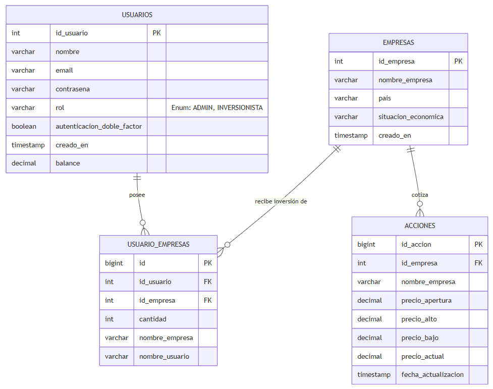
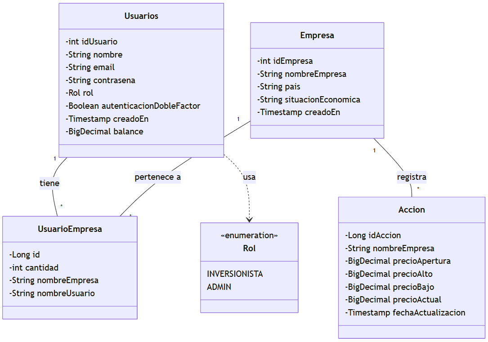
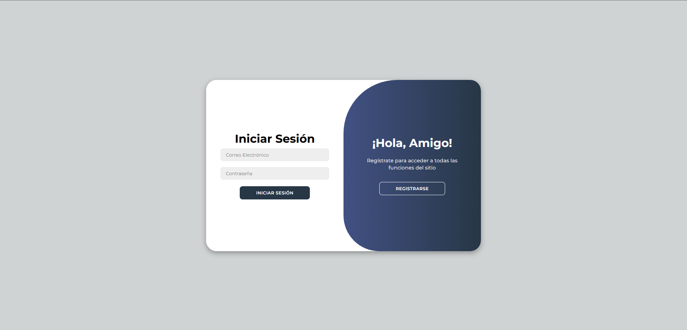
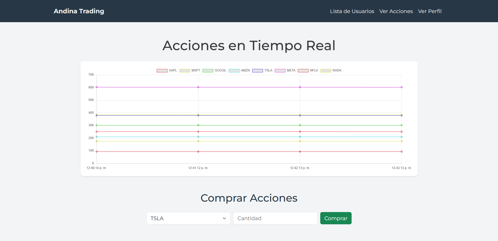
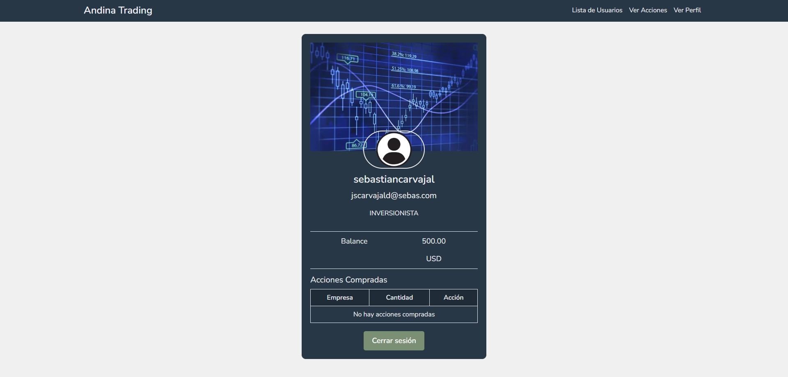

# Andina Trading - Sistema de Gestión Bursátil

**Andina Trading** es una plataforma web desarrollada en **Java y Spring Boot** que permite a los usuarios simular la compra y venta de acciones en el mercado bursátil utilizando datos reales obtenidos a través de la API de Yahoo Finance.

---

## Características Principales

* **Integración de API REST:** Consumo de la API de Yahoo Finance vía RapidAPI para obtener el precio de las acciones en tiempo real.
* **Tareas Programadas (Cron Jobs):** Uso de `@Scheduled` en Spring Boot para actualizar los precios de las acciones en la base de datos automáticamente cada 60 segundos.
* **Gestión de Usuarios y Seguridad:** Registro e inicio de sesión con encriptación de contraseñas utilizando un algoritmo personalizado **AES (Advanced Encryption Standard)**.
* **Lógica de Negocio Financiera:**
    * Sistema de saldo/balance de usuarios.
    * Simulación de compra y venta de acciones calculando el precio actual.
    * Proyección de precios futuros utilizando análisis de medias móviles simples basado en datos históricos.
* **Interfaz de Usuario Interactiva:** Renderizado del lado del servidor con **Thymeleaf**, diseño responsivo con **Bootstrap 5** y gráficos dinámicos con **Chart.js**.

---

## Imagenes

### 1. Diagrama Entidad-Relación

### 2. Diagrama de Clases

### 3. Pantalla de Inicio de Sesión y Registro

### 4. Panel Principal y Gráficos (Chart.js)

### 5. Perfil del Inversionista y Portafolio

---

## Arquitectura y Tecnologías

El proyecto sigue el patrón de diseño **MVC (Modelo-Vista-Controlador)** y arquitectura en capas:

* **Backend:** Java 21, Spring Boot (Web, Data JPA, Scheduling).
* **Frontend:** HTML5, CSS3, Bootstrap 5, Thymeleaf, JavaScript, Chart.js.
* **Base de Datos:** MySQL (Relaciones `@OneToMany`, `@ManyToOne`).
* **Herramientas:** Maven, IntelliJ IDEA, Git, RapidAPI.
